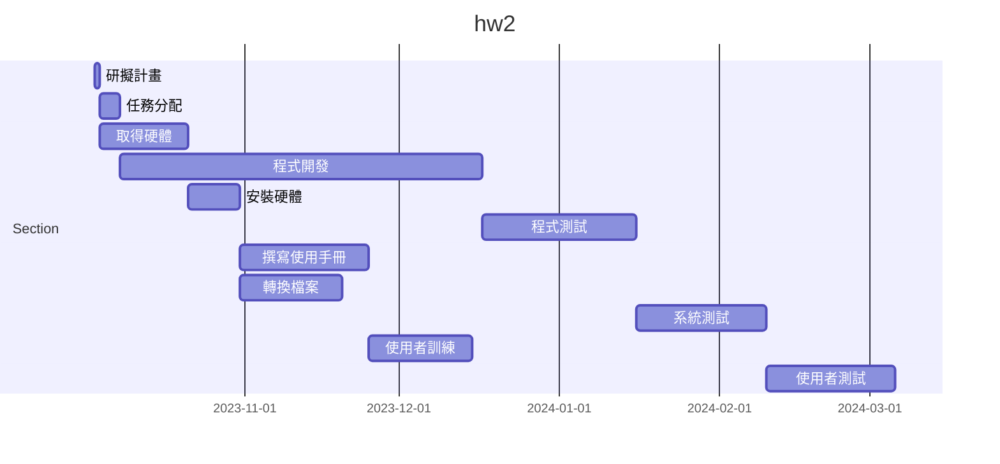

# 專題名稱:輔導室LINE BOT
## 專題介紹:
## 工作分配:
| 姓名 | 工作內容 |
| :-: | :-: |
| 買昭郡 | 開發程式 |
| 黃乙芹 | 文書處理 |
| 龔瑋莉 | 軟體測試 |
| 鄒欣誼 | 文書處理 |
| 林芳螢 | 開發程式 |

開始時間 10/3 結束12/24
## 甘特圖

```mermaid
gantt
    title hw2

    section Section
    研擬計畫     :a1, 2023-10-03, 1d
    任務分配     :a2, after a1  , 4d
    取得硬體     :a3, after a1  , 17d
    程式開發     :a4, after a2 , 70d
    安裝硬體     :a5, after a3  , 10d
    程式測試     :a6, after a4  , 30d
    撰寫使用手冊 :a7, after  a5  , 25d
    轉換檔案     :a8, after a5  , 20d
    系統測試     :a9, after a6  , 25d
    使用者訓練    :a10, after a7 a8  , 20d
    使用者測試    :a11, after a9 a10 , 25d
```
## PERT/CRM & 關鍵路徑

