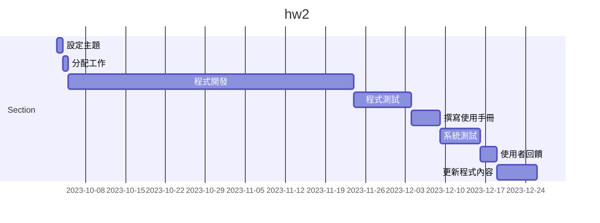
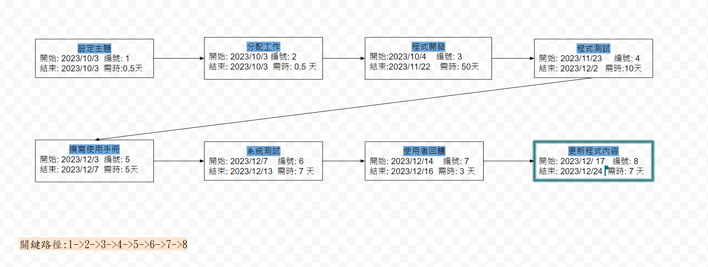
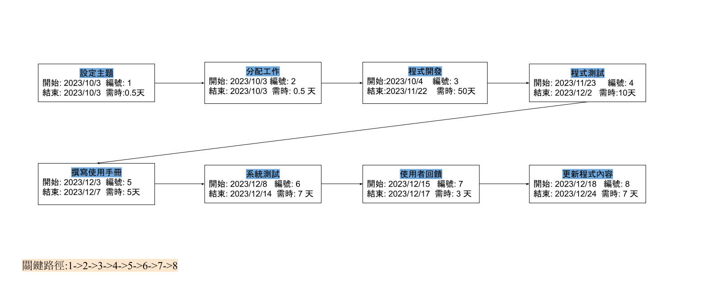

# 專題名稱:輔導室LINE BOT

## 工作分配:
| 姓名 | 工作內容 |
| :-: | :-: |
| 買昭郡 | 設定主題、分配工作、程式開發、程式測試、使用者回饋、更新程式內容|
| 黃乙芹 | 設定主題、分配工作、程式開發、撰寫使用手冊、使用者回饋、更新程式內容 |
| 龔瑋莉 | 設定主題、分配工作、程式開發、程式測試、使用者回饋、更新程式內容 |
| 鄒欣誼 | 設定主題、分配工作、程式開發、撰寫使用手冊、系統測試、使用者回饋 |
| 林芳螢 | 設定主題、分配工作、程式開發、程式測試、系統測試、使用者回饋 |

## 甘特圖

## PERT/CRM

