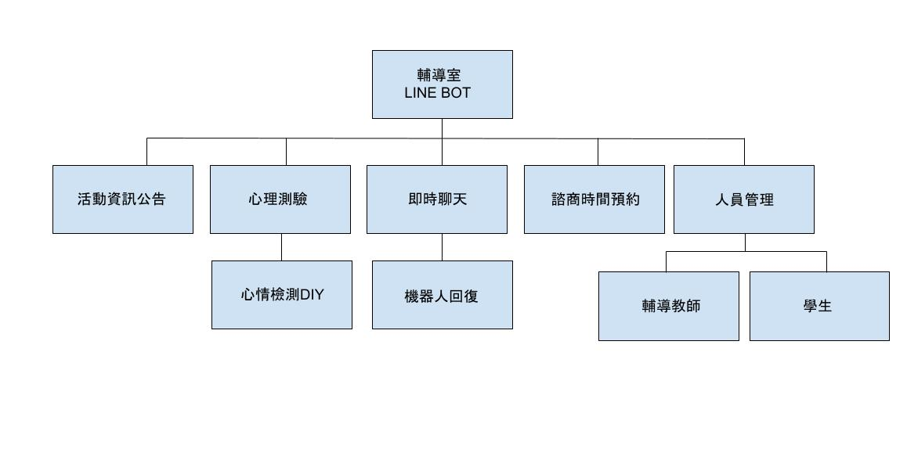

#  輔導室Line bot的管理系統的需求分析簡述如下：

### 功能性需求與非功能性需求

功能性需求：

1.活動內容宣傳：點擊"活動資訊"後，將在聊天室中收到系統自動發送的活動內容，若有外部連結可點擊跳出新視窗。

2.簡易心理狀況測驗：點擊"心理測驗"後，將在聊天室中收到系統自動發送的測驗外部連結，點擊後進入新視窗。

3.諮商預約系統：點擊"諮商預約"後，跳出新視窗進入高科大諮商輔導組預約系統。

4.聊聊：點擊"聊聊"後，將會通知諮商老師有學生申請對話，並由老師回復。

非功能性需求：

1.系統回應速度

2.老師回應速度

3.介面直覺性

4.資訊可信度

5.後臺維護難易度

---

### 功能分解圖

---

### 需求分析的文字描述

（1）教師使用活動資訊內容，更新活動資訊給學生。

（2）學生可藉由心理測驗，取得心理健康分數。

（3）教師可收到學生上傳的心理健康分數。

（4）系統自動判斷測驗成績，若結果不佳系統將主動詢問是否需要幫助。

（5）學生需要幫助時，可藉由諮商預約。

（6）教師收到學生所填寫的預約系統通知。

（7）學生認為自己急需幫助時，可使用即時聊天。

（8）教師收到即時聊天通知，且立即回覆學生。

（9）假如教師無法馬上回覆時，轉介機器人回應。

---

### 使用案例圖及使用案例說明

| 使用案例名稱 | 活動資訊內容 |
| :-: | :-: |
| 行動者 | 老師、學生 |
| 說明 | 描述活動資訊內容功能過程 |
| 完成動作 | 1.老師在後台新增最新活動   2.系統自動將活動內容推撥給有加好友的帳號   3.學生接收活動資訊 |
| 替代方法 | 無 |
| 先決條件 | 老師將活動資訊內容、圖檔都準備齊全上傳到後台 |
| 後至條件 | 活動更新並推撥結束，老師可繼續新增其他活動 |
| 假設 | 無 |

| 使用案例名稱 | 心理測驗 |
| :-: | :-: |
| 行動者 | 老師、學生 |
| 說明 | 描述心理測驗功能過程 |
| 完成動作 | 1.老師在後台建置好心理測驗內容並上傳功能   2.系統在下選單顯示功能按鍵   3.學生按下功能鍵並進行測驗得到結果   4.系統自動上傳測驗結果至後臺給老師進行分析 |
| 替代方法 | 測驗分數過低，詢問是否要進行諮商預約，選擇"是"就連接諮商預約功能 |
| 先決條件 | 老師將心理測驗內容和測驗評斷方式寫在後台程式上 |
| 後至條件 | 心理測驗結束，學生可再重新進行測試 |
| 假設 | 無 |

| 使用案例名稱 | 諮商預約 |
| :-: | :-: |
| 行動者 | 老師、學生 |
| 說明 | 描述諮商預約功能過程 |
| 完成動作 | 1.老師在後台設定連接去諮商預約系統的連結   2.學生點擊選單即可連接至諮商預約系統並進行預約　 3.系統通知老師 |
| 替代方法 | 測驗分數過低，詢問是否要進行諮商預約並學生回答"是"，直接連接諮商預約系統 |
| 先決條件 | 老師在後台設定好連接去諮商預約系統的連結 |
| 後至條件 | 學生成功預約，可以再點進去系統確認預約時間 |
| 假設 | 無 |

| 使用案例名稱 | 即時聊聊 |
| :-: | :-: |
| 行動者 | 老師、學生 |
| 說明 | 描述即時聊聊功能過程 |
| 完成動作 | 1.後台設定好學生按下會回傳"想要即時與人聊聊"訊息   2.系統接收到後並通知老師　 3.老師利用訊息功能立即與學生聊聊 |
| 替代方法 | 處於老師不在的時段or 2分鐘內老師沒出現，機器人自動回應 |
| 先決條件 | 後台有設定好老師不在的時段、通知功能、以及機器人回應功能 |
| 後至條件 | 學生使用完過一陣子又需要可以再使用點下按鈕去使用 |
| 假設 | 無 |
---

### 使用Figma劃出第一個使用案例的動態模擬畫面

https://www.figma.com/proto/BQeZLS9oJMupXczxRFXjZk/LINE-BOT?type=design&node-id=219-961&t=l2feJ9njJGtSy1PD-0&scaling=scale-down&page-id=101%3A163&starting-point-node-id=219%3A961&show-proto-sidebar=1
